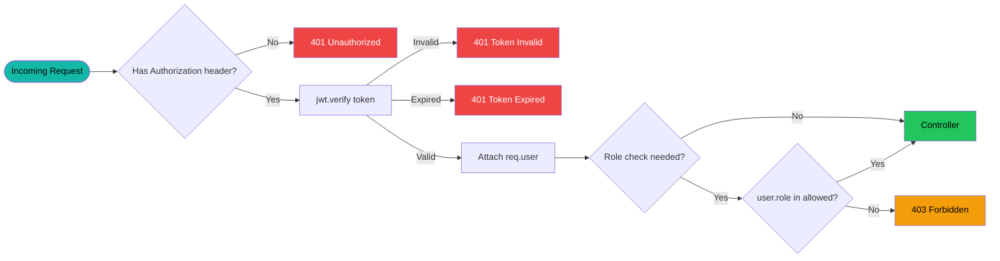
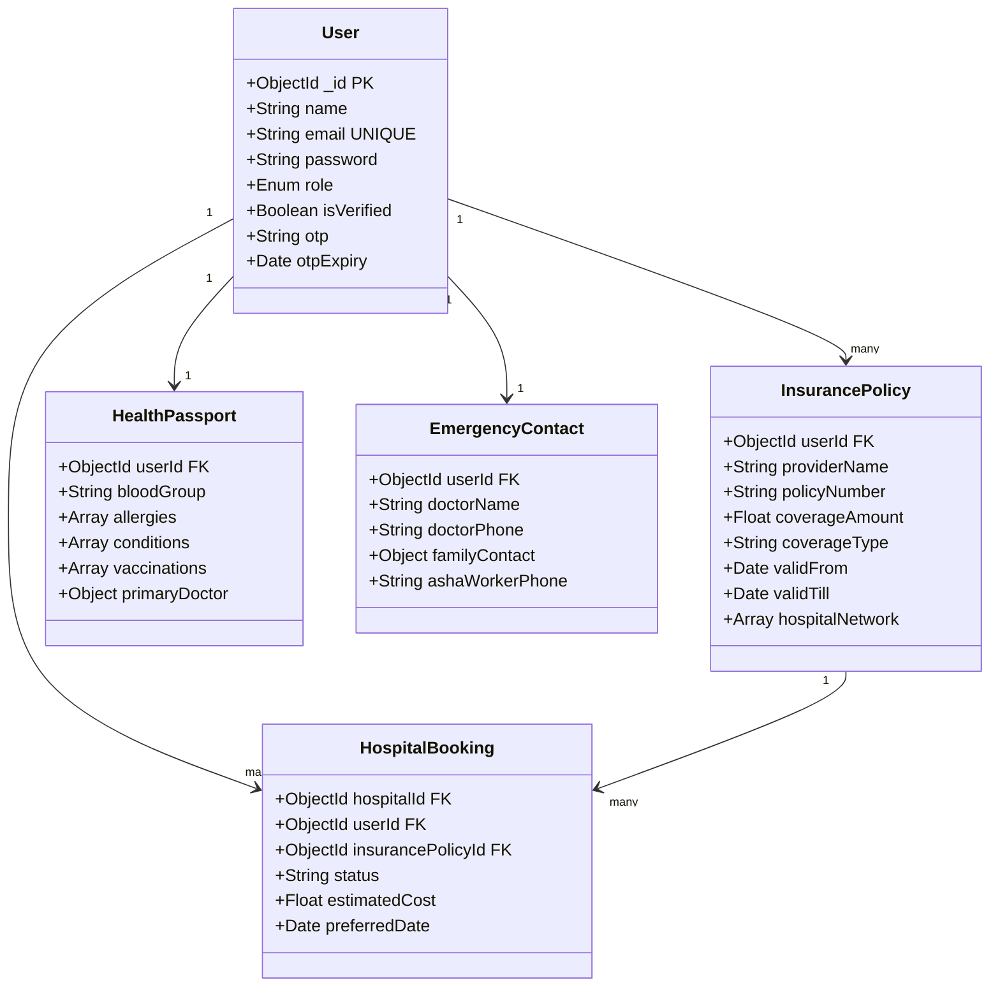

# 🔧 MaaCare — Backend Documentation

> **Node.js + Express + MongoDB** REST API powering the MaaCare maternal healthcare platform

---

## 🏗️ Architecture Overview

```mermaid
graph TB
    subgraph ENTRY["📍 Entry: index.js"]
        A[Express App]
        B[HTTP Server]
        C[Socket.IO]
        D[node-cron Jobs]
    end

    subgraph MIDDLE["🔀 Middleware Stack"]
        E[Helmet — Security Headers]
        F[CORS — Origin Whitelist]
        G[JSON Body Parser]
        H[Multer — File Uploads]
    end

    subgraph AUTH["🔐 Auth Guard"]
        I[protect — jwt.verify]
        J[authorize — role check]
    end

    subgraph ROUTES["🔁 Route Modules /api/*"]
        K1[/auth]
        K2[/doctors, /appointments, /teleconsult]
        K3[/hospitals, /hospital-bookings]
        K4[/insurance, /health-passport, /navigation, /emergency]
        K5[/forum, /reviews, /chat, /feedback]
        K6[/analytics, /insights, /asha, /schemes]
    end

    subgraph DB["🗄️ Persistence"]
        L[(MongoDB Atlas)]
        M[(Cloudinary)]
        N[(Gmail SMTP)]
    end

    A --> MIDDLE --> AUTH --> ROUTES
    ROUTES --> L
    H --> M
    D --> N
    C -.->|WebSocket| ROUTES

    style ENTRY fill:#0f2027,stroke:#14b8a6,color:#fff
    style MIDDLE fill:#0a1628,stroke:#22d3ee,color:#fff
    style AUTH fill:#1a0a0a,stroke:#ef4444,color:#fff
    style ROUTES fill:#071224,stroke:#14b8a6,color:#fff
    style DB fill:#0a1a0a,stroke:#22c55e,color:#fff
```

---

## 📡 Complete API Reference

### 🔐 Auth Endpoints (`/api/auth`)

| Method | Endpoint | Description | Body | Auth |
|--------|----------|-------------|------|------|
| `POST` | `/register` | Register new user | `{name, email, password, role}` | No |
| `POST` | `/login` | Login + JWT | `{email, password}` | No |
| `POST` | `/verify-otp` | Verify OTP | `{email, otp}` | No |
| `POST` | `/resend-otp` | Resend OTP | `{email}` | No |
| `POST` | `/forget-password` | Request reset | `{email}` | No |
| `POST` | `/reset-password` | Reset password | `{email, otp, newPassword}` | No |
| `GET` | `/me` | Current user | — | ✅ Yes |

### 🩺 Doctors (`/api/doctors`)

| Method | Endpoint | Description | Auth |
|--------|----------|-------------|------|
| `GET` | `/` | List doctors (filter: specialization, name) | No |
| `GET` | `/:id` | Doctor profile | No |
| `POST` | `/` | Create doctor profile | Doctor |
| `PUT` | `/:id` | Update profile | Doctor |

### 📅 Appointments (`/api/appointments`)

| Method | Endpoint | Description | Auth |
|--------|----------|-------------|------|
| `POST` | `/` | Book appointment | Mother |
| `GET` | `/my` | User's appointments | Any |
| `GET` | `/:id` | Appointment details | Any |
| `PUT` | `/:id/status` | Update status | Doctor |

### 🏥 Hospitals (`/api/hospitals`)

| Method | Endpoint | Description | Auth |
|--------|----------|-------------|------|
| `GET` | `/` | List all hospitals | No |
| `GET` | `/:id` | Hospital + services + beds | No |
| `POST` | `/register` | Register hospital | Admin |
| `PUT` | `/dashboard/me` | Update hospital info | Hospital |
| `POST` | `/emergency` | Emergency alert | No |

### 📋 Hospital Bookings (`/api/hospital-bookings`)

| Method | Endpoint | Description | Auth |
|--------|----------|-------------|------|
| `POST` | `/` | Create booking | Any |
| `GET` | `/my` | User bookings | Any |
| `GET` | `/hospital-bookings` | Hospital's bookings | Hospital |
| `PUT` | `/:id/status` | Approve / Reject | Hospital |

### 🛡️ Insurance (`/api/insurance`)

| Method | Endpoint | Description | Auth |
|--------|----------|-------------|------|
| `POST` | `/` | Add policy | Any |
| `GET` | `/` | All user policies | Any |
| `DELETE` | `/:id` | Delete policy | Any |
| `GET` | `/:id/coverage` | Check hospital network | Any |

```
GET /api/insurance/:id/coverage?hospitalName=Apollo+Hospitals
→ { isCovered: true, hospitalName: "Apollo Hospitals" }
```

### 🆔 Health Passport (`/api/health-passport`)

| Method | Endpoint | Description | Auth |
|--------|----------|-------------|------|
| `POST` | `/` | Create/Update passport | Any |
| `GET` | `/` | Get user passport | Any |

### 🗺️ Navigation (`/api/navigation`)

| Method | Endpoint | Description | Auth |
|--------|----------|-------------|------|
| `GET` | `/journey` | Step-by-step care journey | Any |

```
GET /api/navigation/journey?condition=anemia
→ { journey: [{ step, title, description, type, icon }] }
```

### 🚨 Emergency (`/api/emergency`)

| Method | Endpoint | Description | Auth |
|--------|----------|-------------|------|
| `POST` | `/sos` | Trigger SOS alert | Any |
| `POST` | `/contacts` | Save emergency contacts | Any |
| `GET` | `/contacts` | Get contacts | Any |

### 💬 Chat (`/api/chat`)

| Method | Endpoint | Description | Auth |
|--------|----------|-------------|------|
| `GET` | `/contacts` | Conversation contacts | Any |
| `GET` | `/:userId` | Chat history | Any |
| `POST` | `/send` | Send message (auto-translated) | Any |

---

## 🔐 JWT Middleware Flow



---

## 🗄️ Database Models



---

## 📧 Nodemailer Email Types

| Trigger | Template | Recipients |
|---------|----------|-----------|
| User registers | OTP verification code | New user |
| Password reset | Reset link + OTP | User |
| Appointment booked | Booking confirmation | User + Doctor |
| Hospital booking | Confirmation with insurance breakdown | Patient |
| Hospital booking status | Approved/Rejected notification | Patient |
| Emergency SOS | 🚨 SOS alert with location | User |
| Daily cron | Appointment reminders | All users due tomorrow |

---

## ⚙️ Background Jobs (`utils/`)

```mermaid
gantt
    title Background Job Schedule (UTC+5:30)
    dateFormat HH:mm
    section notificationScheduler.js
    Morning health reminders (8AM)  :08:00, 10m
    section reminderScheduler.js
    Booking 24h advance notice (hourly) :00:00, 5m
```



---

## 🔧 Environment Setup

```bash
# 1. Install dependencies
cd BACKEND && npm install

# 2. Create .env file
touch .env
```

```env
MONGODB_URI=mongodb+srv://<user>:<pass>@cluster.mongodb.net/maacare
PORT=5000
JWT_SECRET=your_very_long_random_jwt_secret_here
EMAIL_USER=youremail@gmail.com
EMAIL_PASS=your_16_char_gmail_app_password
CLOUDINARY_CLOUD_NAME=your_cloud_name
CLOUDINARY_API_KEY=your_api_key
CLOUDINARY_API_SECRET=your_api_secret
FRONTEND_URL=https://matrucare-ai.netlify.app
```

> [!IMPORTANT]
> `EMAIL_PASS` must be a **Gmail App Password** (16 characters), NOT your regular Google account password. Generate it at: [myaccount.google.com/apppasswords](https://myaccount.google.com/apppasswords)

```bash
# 3. Run dev server
npm run dev  # nodemon auto-restarts on changes

# 4. Run production server  
npm start    # node index.js
```

---

## 🐛 Error Response Standard

```json
{
  "success": false,
  "message": "Descriptive error message explaining what went wrong"
}
```

| Status Code | When Used |
|------------|-----------|
| `200` | Successful GET / operation |
| `201` | Resource successfully created |
| `400` | Missing required fields / Validation error |
| `401` | Missing or invalid JWT token |
| `403` | Wrong role (token valid but insufficient permissions) |
| `404` | Resource not found in database |
| `500` | Unhandled server exception (check server logs) |
