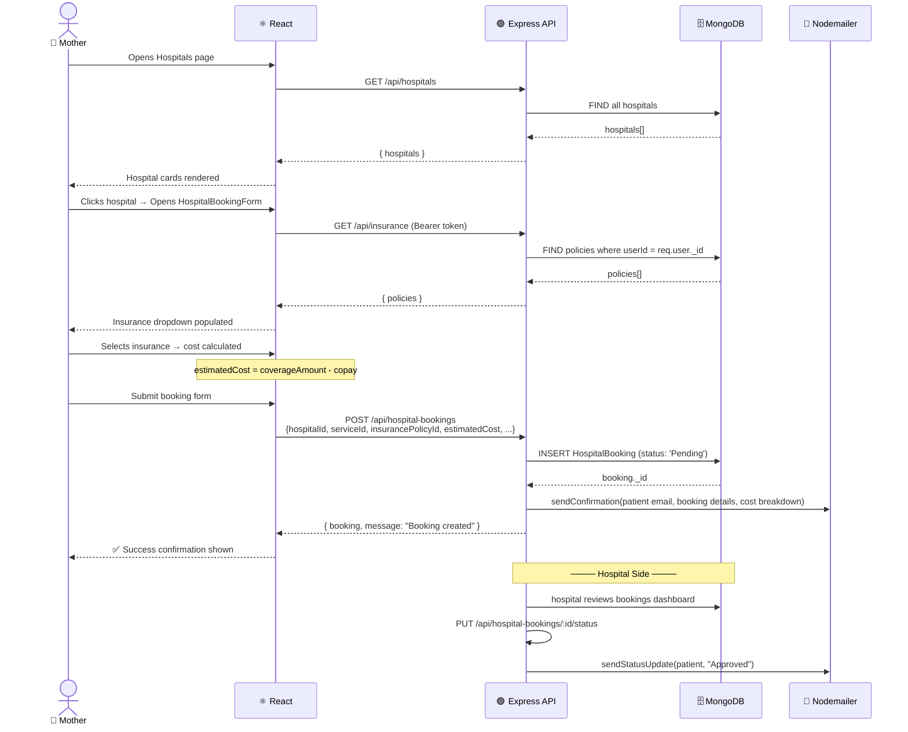
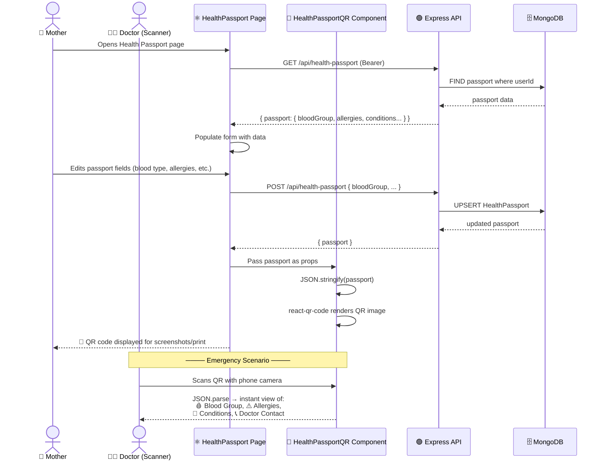
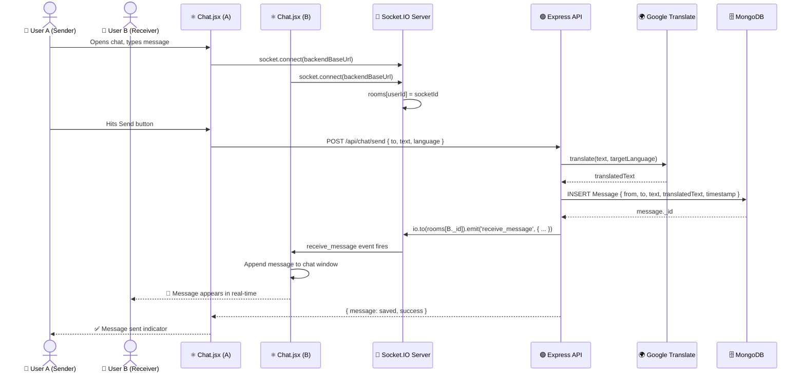
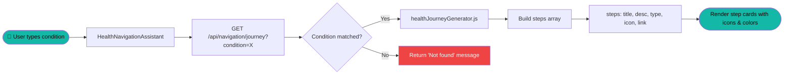
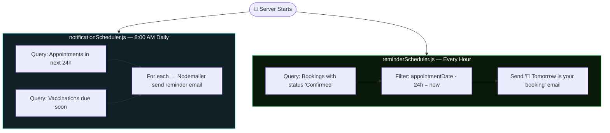
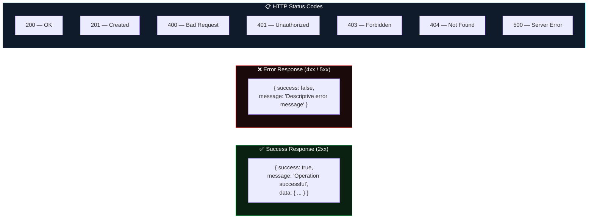

# 🔄 MaaCare — API Data Flow Documentation

> Step-by-step sequence diagrams for every major platform operation

---

## 1. 🔐 Authentication & Registration Flow


*Complete registration + OTP verification + JWT login flow*

```mermaid
sequenceDiagram
    actor U as 👩 User
    participant FE as ⚛️ React Frontend
    participant BE as 🟢 Express API
    participant DB as 🗄️ MongoDB
    participant EMAIL as 📧 Gmail SMTP

    rect rgb(15, 32, 39)
        Note over U,EMAIL: ──── Step 1: Register ────
        U->>FE: Fills registration form
        FE->>BE: POST /api/auth/register<br/>{name, email, password, role}
        BE->>BE: bcrypt.hash(password, 10)
        BE->>BE: generateOTP() → 6 digits
        BE->>DB: INSERT user (isVerified:false)
        DB-->>BE: user._id created
        BE->>EMAIL: sendMail(OTP, subject: "Verify your MaaCare account")
        BE-->>FE: { message: "OTP sent to your email" }
    end

    rect rgb(10, 22, 40)
        Note over U,EMAIL: ──── Step 2: Verify OTP ────
        U->>FE: Enters 6-digit OTP
        FE->>BE: POST /api/auth/verify-otp { email, otp }
        BE->>DB: FIND user by email
        DB-->>BE: user (otp, otpExpiry)
        BE->>BE: Check OTP match + expiry
        BE->>DB: UPDATE isVerified = true
        BE-->>FE: { success: true }
    end

    rect rgb(7, 18, 36)
        Note over U,EMAIL: ──── Step 3: Login ────
        U->>FE: email + password → Login button
        FE->>BE: POST /api/auth/login { email, password }
        BE->>DB: FIND user by email
        DB-->>BE: user with hashed password
        BE->>BE: bcrypt.compare(input, hash) ✓
        BE->>BE: jwt.sign(payload, secret, 7d)
        BE-->>FE: { token, user: { name, role } }
        FE->>FE: localStorage.setItem('token')
        FE->>FE: AuthContext.login(token) → user state
        FE-->>U: Redirect to Dashboard
    end
```



---

## 2. 🏥 Hospital Booking Data Flow


*Complete booking journey from hospital browsing to approval*



---

## 3. 🚨 Emergency SOS Data Flow


*Location capture + DB persistence + email alert in under 3 seconds*

```mermaid
sequenceDiagram
    actor U as 👩 User (High Risk)
    participant GEO as 📍 GPS API
    participant FE as ⚛️ EmergencySOSPanel
    participant BE as 🟢 Express
    participant DB as 🗄️ MongoDB
    participant EMAIL as 📧 Nodemailer

    U->>FE: 🔴 Clicks SOS Button
    FE->>GEO: navigator.geolocation.getCurrentPosition()
    GEO-->>FE: { latitude, longitude }
    FE->>FE: Update UI: "Locating you..."

    FE->>BE: POST /api/emergency/sos<br/>{ location: {lat,lng}, riskLevel: 'high' }
    BE->>DB: FIND EmergencyContact where userId
    DB-->>BE: contact { doctorPhone, familyContact, ashaPhone }
    BE->>DB: INSERT EmergencyEvent { userId, location, timestamp }
    DB-->>BE: event._id

    BE->>EMAIL: sendSOS({
        to: user.email,
        subject: "🚨 MaaCare SOS Alert",
        body: location link + contact numbers + timestamp
    })

    BE-->>FE: { success, eventId }
    FE->>FE: Update UI: "✅ SOS Sent! Help on the way"
    FE->>FE: Show contact numbers panel
```

---

## 4. 🆔 Digital Health Passport & QR Flow


*Create once, scan anywhere — instant medical context for first responders*



---

## 5. 💬 Real-Time Chat Data Flow



---

## 6. 🗺️ AI Health Navigation Flow



**Supported Conditions:** Anemia, Gestational Diabetes, Hypertension, Preeclampsia, Thyroid, Normal Pregnancy

---

## 7. ⏰ Background Notification Flow



---

## 8. 📡 Standard API Response Format



---

## 9. 🖼️ API Auth Header Pattern

Every authenticated request from the frontend follows this pattern:

```javascript
// ✅ Correct pattern used throughout MaaCare frontend
const token = localStorage.getItem('token');

const response = await axios.get(`${import.meta.env.VITE_API_URL}/endpoint`, {
    headers: { 
        Authorization: `Bearer ${token}` 
    }
});

// VITE_API_URL = "http://localhost:5000/api"  (includes /api already!)
// Endpoint paths are relative: /insurance, /hospitals, etc.
```

> [!WARNING]
> **Never** hardcode `localhost:5000` — always use `import.meta.env.VITE_API_URL`. Also note `VITE_API_URL` already includes `/api`, so endpoint paths must NOT repeat it.
