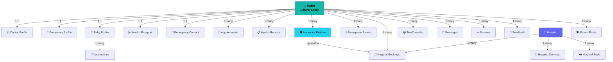
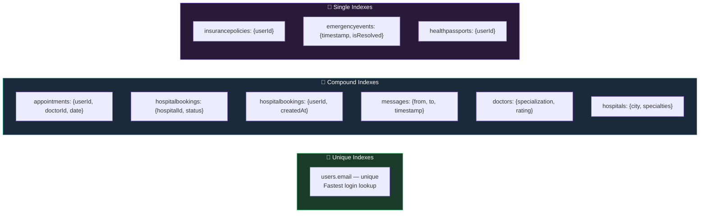

# 🗃️ MaaCare — Entity-Relationship Diagram

> MongoDB data model relationships with visual diagrams and index strategy

---

## Visual ER Overview


*MongoDB collection relationships centered on the User entity*

---

## 🗺️ Complete Entity Relationship Map

```mermaid
erDiagram
    USER {
        ObjectId _id PK
        string name
        string email UK
        string password
        enum role
        boolean isVerified
        string otp
        Date otpExpiry
        string profileImage
    }

    DOCTOR_PROFILE {
        ObjectId _id PK
        ObjectId userId FK
        string specialization
        string[] qualifications
        int experience
        string availability
        float rating
        string contactNumber
    }

    PREGNANCY_PROFILE {
        ObjectId _id PK
        ObjectId userId FK
        Date dueDate
        int weeksPregnant
        string riskLevel
        int kickCount
        string trimester
        float weight
        float height
    }

    BABY_PROFILE {
        ObjectId _id PK
        ObjectId userId FK
        string name
        Date birthDate
        float weight
        float height
        string bloodGroup
    }

    APPOINTMENT {
        ObjectId _id PK
        ObjectId userId FK
        ObjectId doctorId FK
        Date date
        string time
        string type
        string status
        string notes
    }

    INSURANCE_POLICY {
        ObjectId _id PK
        ObjectId userId FK
        string providerName
        string policyNumber
        float coverageAmount
        string coverageType
        Date validFrom
        Date validTill
        string[] hospitalNetwork
        string documentUrl
    }

    HEALTH_PASSPORT {
        ObjectId _id PK
        ObjectId userId FK
        string bloodGroup
        string[] allergies
        string[] conditions
        object[] vaccinations
        object primaryDoctor
        string insuranceProvider
    }

    EMERGENCY_CONTACT {
        ObjectId _id PK
        ObjectId userId FK
        string doctorName
        string doctorPhone
        object familyContact
        string ashaWorkerName
        string ashaWorkerPhone
        string phoneNumber
    }

    EMERGENCY_EVENT {
        ObjectId _id PK
        ObjectId userId FK
        object location
        string riskLevel
        string message
        Date timestamp
        boolean isResolved
    }

    HOSPITAL {
        ObjectId _id PK
        ObjectId adminId FK
        string name
        string address
        string[] specialties
        float rating
        string contactNumber
        string email
        string imageUrl
    }

    HOSPITAL_BOOKING {
        ObjectId _id PK
        ObjectId hospitalId FK
        ObjectId userId FK
        ObjectId serviceId FK
        ObjectId insurancePolicyId FK
        string patientName
        string patientEmail
        string mobileNumber
        Date preferredDate
        string status
        float estimatedCost
        string notes
    }

    HEALTH_RECORD {
        ObjectId _id PK
        ObjectId userId FK
        string type
        string fileUrl
        string aiSummary
        Date date
        string description
    }

    TELE_CONSULT {
        ObjectId _id PK
        ObjectId userId FK
        ObjectId doctorId FK
        string sessionId
        string status
        Date scheduledAt
        string notes
        int duration
    }

    MESSAGE {
        ObjectId _id PK
        ObjectId from FK
        ObjectId to FK
        string text
        string translatedText
        string language
        Date timestamp
    }

    USER ||--o{ APPOINTMENT : "books"
    USER ||--o{ HEALTH_RECORD : "has"
    USER ||--o{ INSURANCE_POLICY : "owns"
    USER ||--o{ EMERGENCY_EVENT : "triggers"
    USER ||--o{ HOSPITAL_BOOKING : "makes"
    USER ||--o{ TELE_CONSULT : "schedules"
    USER ||--o{ MESSAGE : "sends"
    USER ||--|| DOCTOR_PROFILE : "extends to"
    USER ||--|| PREGNANCY_PROFILE : "has"
    USER ||--|| BABY_PROFILE : "tracks"
    USER ||--|| HEALTH_PASSPORT : "creates"
    USER ||--|| EMERGENCY_CONTACT : "stores"
    DOCTOR_PROFILE ||--o{ APPOINTMENT : "receives"
    DOCTOR_PROFILE ||--o{ TELE_CONSULT : "hosts"
    HOSPITAL ||--o{ HOSPITAL_BOOKING : "receives"
    INSURANCE_POLICY ||--o{ HOSPITAL_BOOKING : "applied to"
```



---

## 🔗 Relationship Summary



---

## 📋 All Collections Reference

| Collection | Key Fields | Primary Relations |
|-----------|-----------|------------------|
| `users` | _id, name, email, role, isVerified | Root of all relations |
| `doctors` | userId, specialization, rating | → users |
| `appointments` | userId, doctorId, date, status | → users, doctors |
| `pregnancyprofiles` | userId, dueDate, riskLevel | → users |
| `healthrecords` | userId, type, fileUrl, aiSummary | → users |
| `ashavisits` | ashaId, userId, date, notes | → users |
| `governmentschemes` | name, eligibility, benefits | Standalone |
| `babyprofiles` | userId, name, birthDate | → users |
| `vaccinations` | babyId, vaccine, date, done | → babyprofiles |
| `teleconsults` | userId, doctorId, sessionId | → users |
| `reviews` | userId, doctorId, rating | → users |
| `forums` | userId, title, replies[] | → users |
| `dietplans` | userId, meals[], week | → users |
| `messages` | from, to, text, translatedText | → users |
| `feedbacks` | userId, rating, comment | → users |
| `hospitals` | adminId, name, specialties | → users |
| `hospitalservices` | hospitalId, name, price | → hospitals |
| `hospitalbeds` | hospitalId, wardType, available | → hospitals |
| `hospitalbookings` | userId, hospitalId, insurancePolicyId | → users, hospitals, insurance |
| `mentormothers` | userId, experience, languages | → users |
| `insurancepolicies` | userId, providerName, coverage | → users |
| `healthpassports` | userId, bloodGroup, allergies | → users |
| `emergencycontacts` | userId, doctorPhone, familyContact | → users |
| `emergencyevents` | userId, location, timestamp | → users |

---

## ⚡ Index Strategy



### MongoDB Index Declarations

```javascript
// Unique email — fastest login
User.schema.index({ email: 1 }, { unique: true });

// Appointment queries (user OR doctor dashboards)
Appointment.schema.index({ userId: 1, doctorId: 1, date: -1 });

// Hospital booking dashboards (by hospital + status filter)
HospitalBooking.schema.index({ hospitalId: 1, status: 1 });
HospitalBooking.schema.index({ userId: 1, createdAt: -1 });

// Chat history (bidirectional conversation)
Message.schema.index({ from: 1, to: 1, timestamp: -1 });

// Emergency monitoring (admin view, newest first)
EmergencyEvent.schema.index({ timestamp: -1, isResolved: 1 });

// Doctor search (by specialty, sorted by rating)
Doctor.schema.index({ specialization: 1, rating: -1 });

// Hospital search (by location/specialty)
Hospital.schema.index({ city: 1, specialties: 1 });

// Fast passport & insurance lookups by userId
HealthPassport.schema.index({ userId: 1 });
InsurancePolicy.schema.index({ userId: 1 });
```

> [!TIP]
> MongoDB Atlas (M10+) automatically suggests missing indexes via **Performance Advisor**. Enable this in production for any collections receiving high traffic.
