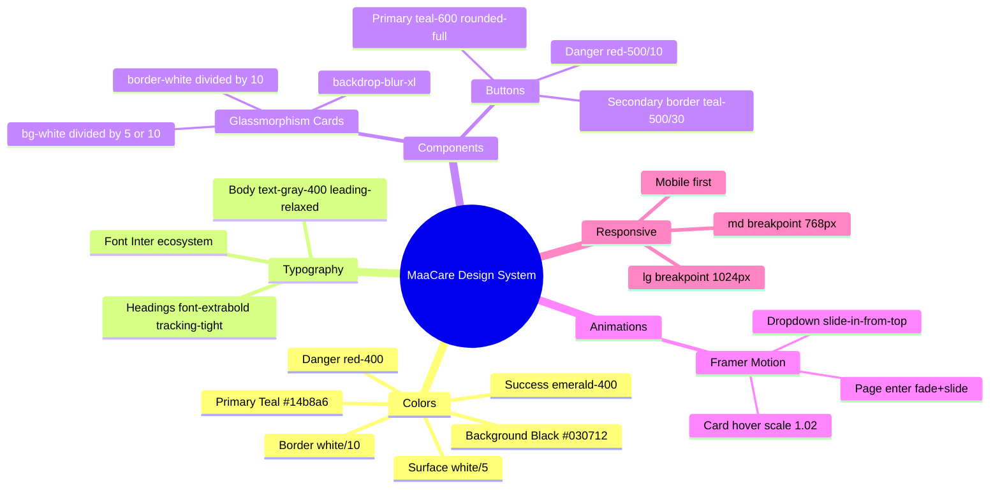
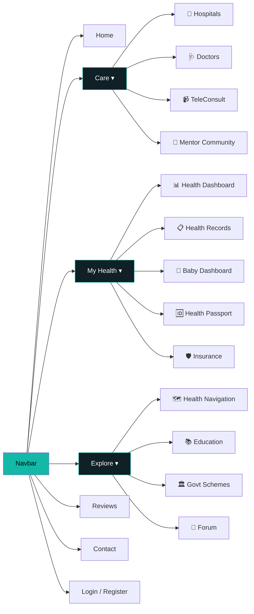
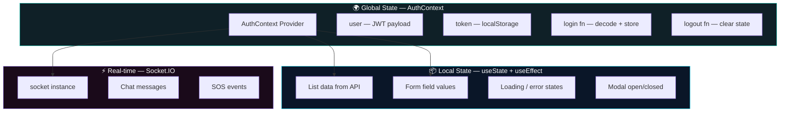
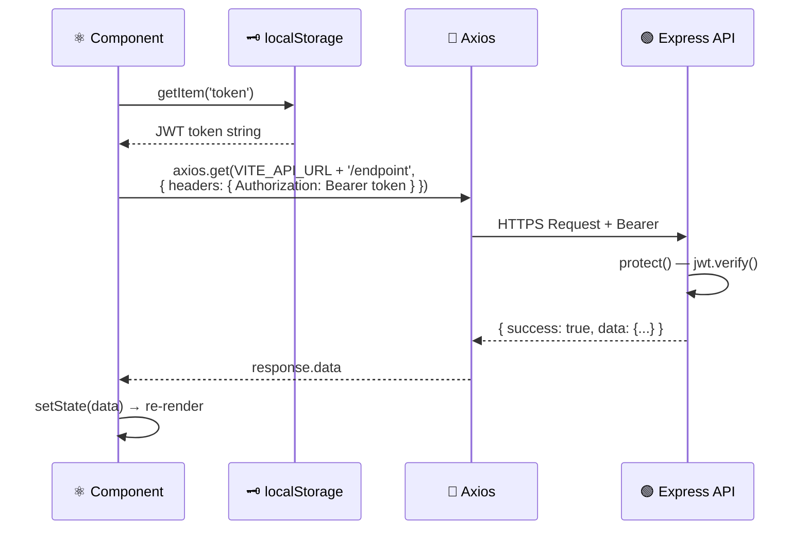
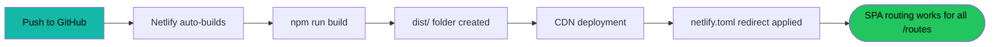

# 🖥️ MaaCare — Frontend Documentation

> **React 19 + Vite 7 + Tailwind CSS 4** powering the MaaCare user interface

---

## 🗂️ Component Tree Overview


*React component hierarchy from App.jsx down to leaf components*

---

## 🔀 Application Routing Architecture

```mermaid
flowchart TD
    A([main.jsx]) --> B[App.jsx — BrowserRouter]
    B --> NAV[🔝 Navbar — always visible]
    B --> VOICE[🎤 VoiceNavigator — Accessibility]
    B --> ROUTES[Routes]

    ROUTES --> PUB[Public Routes]
    ROUTES --> PROT[🔐 Protected Routes<br/>ProtectedRoute HOC]

    PUB --> PUB1[/ Home]
    PUB --> PUB2[/about, /contact]
    PUB --> PUB3[/doctors, /hospitals, /hospitals/:id]
    PUB --> PUB4[/mentor-community, /schemes, /forum]
    PUB --> PUB5[/reviews, /education]
    PUB --> PUB6[/login, /register, /verify-otp]

    PROT --> MOTHER[👩 Mother Only]
    PROT --> DOCTOR[🩺 Doctor Only]
    PROT --> ASHA[🌿 ASHA Only]
    PROT --> ADMIN[👑 Admin Only]
    PROT --> ALL[🌐 All Roles]

    MOTHER --> M1[/health-dashboard]
    MOTHER --> M2[/baby-dashboard]
    MOTHER --> M3[/teleconsult]
    DOCTOR --> D1[/dashboard/doctor]
    ASHA --> A1[/dashboard/asha]
    ADMIN --> AD1[/analytics, /insights]
    ALL --> AL1[/insurance, /passport, /navigation]

    style A fill:#14b8a6,color:#000
    style PROT fill:#1a0a0a,stroke:#ef4444,color:#fff
    style PUB fill:#0f2027,stroke:#14b8a6,color:#fff
```

---

## 🎨 Design System



---

## 🧩 Component Catalogue

### 🔝 Navigation
| Component | File | Description |
|-----------|------|-------------|
| Navbar | `Navbar.jsx` | Sticky top nav, 3 dropdown menus, mobile accordion, auth-aware |

**Navbar Dropdown Groups:**



### 🔐 Auth Components
| Component | Description |
|-----------|-------------|
| `Login.jsx` | Email + password with JWT handling |
| `Register.jsx` | Multi-role registration form |
| `VerifyOtp.jsx` | 6-digit OTP code input |
| `ForgetPassword.jsx` | Reset request form |
| `ResendOtp.jsx` | OTP resend trigger |

### 🏥 Hospital Components
| Component | Description |
|-----------|-------------|
| `HospitalCard.jsx` | Hospital listing card with specialties & rating |
| `HospitalServiceCard.jsx` | Individual service + Book button |
| `HospitalBookingForm.jsx` | Full booking with insurance selector + dynamic cost estimate |

### 🆕 New Feature Components
| Component | Description |
|-----------|-------------|
| `InsuranceCard.jsx` | Policy display: provider, validity, coverage amount |
| `InsuranceForm.jsx` | Add policy: type, dates, hospital network, policy # |
| `HealthPassportQR.jsx` | Renders QR from passport JSON using `react-qr-code` |
| `HealthNavigationAssistant.jsx` | Condition search → step-by-step journey cards |
| `EmergencySOSPanel.jsx` | Red SOS button, GPS capture, status updates |
| `ContactEmergencyCard.jsx` | Doctor, family, ASHA contacts form + ambulance # |
| `EmergencyHospitalAlert.jsx` | Nearby hospital quick alert trigger |

### 💬 Community Components
| Component | Description |
|-----------|-------------|
| `DietPlanner.jsx` | Today's meals with completion toggle |
| `SubmitFeedback.jsx` | Star rating + comment form |
| `ReviewCard.jsx` | Display user review card |
| `TeleConsultCard.jsx` | Teleconsult session card |

---

## 📄 Pages Reference

| Page | Route | Role | Key Features |
|------|-------|------|-------------|
| `Home.jsx` | `/` | All | Hero, features showcase, CTAs |
| `Hospitals.jsx` | `/hospitals` | All | Search, emergency alert panel |
| `HospitalDetails.jsx` | `/hospitals/:id` | All | Services, beds, booking form |
| `HospitalDashboard.jsx` | `/dashboard/hospital` | Hospital | Bookings table, approval |
| `HealthDashboard.jsx` | `/health-dashboard` | Mother | Pregnancy vitals tracker |
| `BabyDashboard.jsx` | `/baby-dashboard` | Mother | Milestones + vaccinations |
| `HealthRecords.jsx` | `/health-records` | Mother | AI-summarized medical docs |
| `InsuranceDashboard.jsx` | `/insurance` | All | Policy management, coverage check |
| `HealthPassport.jsx` | `/passport` | All | Edit passport + view QR |
| `HealthNavigation.jsx` | `/navigation` | All | Journey wizard + Emergency hub |
| `TeleConsult.jsx` | `/teleconsult` | Mother/Doctor | Book + join video room |
| `Chat.jsx` | `/chat` | All | Real-time multilingual messaging |
| `Reviews.jsx` | `/reviews` | All | Community feedback wall |
| `Education.jsx` | `/education` | All | Maternal health resources |
| `Forum.jsx` | `/forum` | All | Q&A community |
| `GovernmentSchemes.jsx` | `/schemes` | All | Welfare programs directory |

---

## 🔄 State Management



---

## 🌐 API Integration Pattern



---

## ⚙️ Environment & Setup

```bash
# Install dependencies
cd FRONTEND && npm install

# Create .env
echo "VITE_API_URL=http://localhost:5000/api" > .env

# Dev server (http://localhost:5173)
npm run dev

# Production build
npm run build
```

```env
# FRONTEND/.env
VITE_API_URL=http://localhost:5000/api
```

> [!IMPORTANT]
> `VITE_API_URL` **must include `/api`** — e.g. `http://localhost:5000/api`. All component fetch calls use relative paths like `/insurance`, `/hospitals` etc. without repeating `/api`.

---

## 🚀 Deployment (Netlify)



**netlify.toml** (already configured):
```toml
[[redirects]]
from = "/*"
to = "/index.html"
status = 200
```

**Build Settings:**
| Setting | Value |
|---------|-------|
| Build command | `npm run build` |
| Publish directory | `dist` |
| Environment variable | `VITE_API_URL = https://your-backend.com/api` |

---

## 📦 Key Dependencies Explained

| Package | Why It's Used |
|---------|--------------|
| `react-router-dom v7` | Client-side routing with `useNavigate`, `useParams`, `Link` |
| `axios` | HTTP client with better error handling than `fetch` |
| `framer-motion` | Page entry + hover animations for premium feel |
| `lucide-react` | Consistent, lightweight icon set (500+ icons) |
| `socket.io-client` | WebSocket for real-time chat + SOS |
| `react-qr-code` | Client-side QR generation for Health Passport |
| `@jitsi/react-sdk` | Embeds Jitsi Meet for in-browser video calls |
| `i18next` | Internationalization for multilingual UI support |
| `tailwindcss v4` | Utility CSS — responsive dark glassmorphic design |
