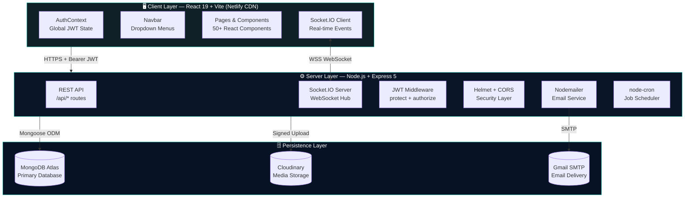
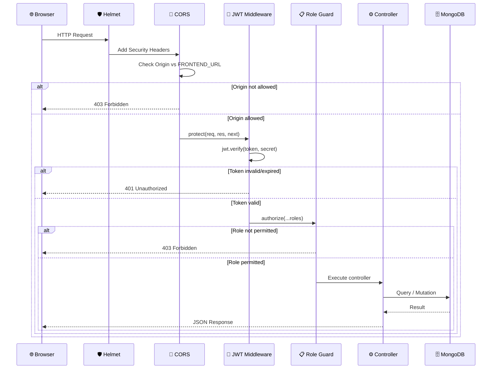
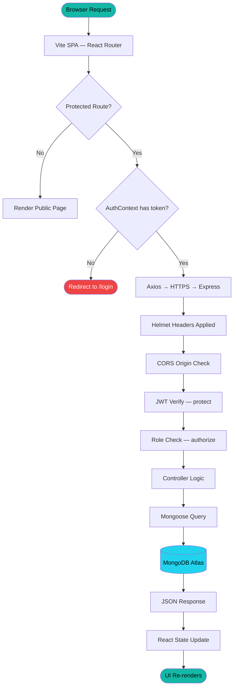
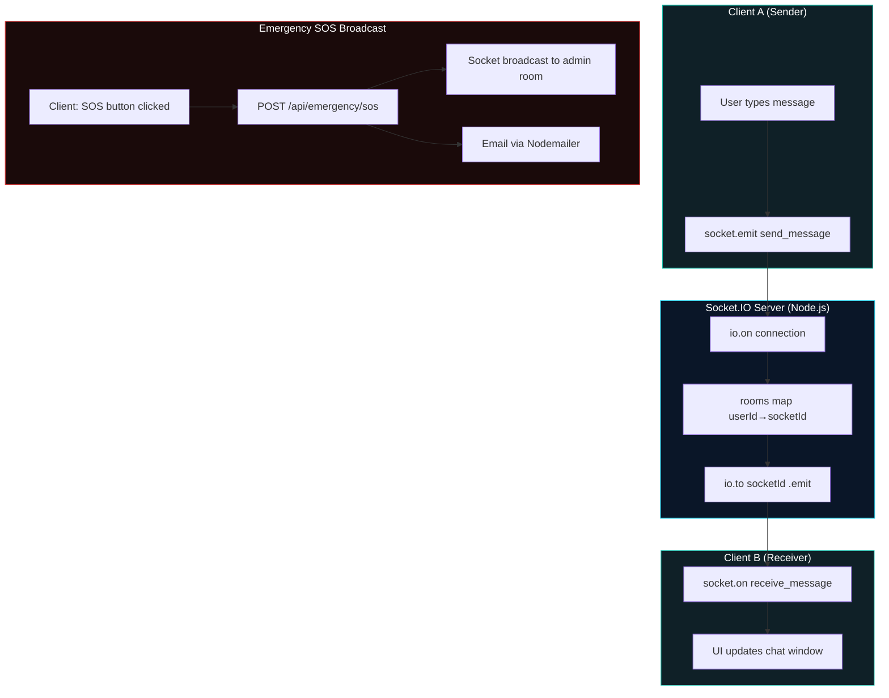
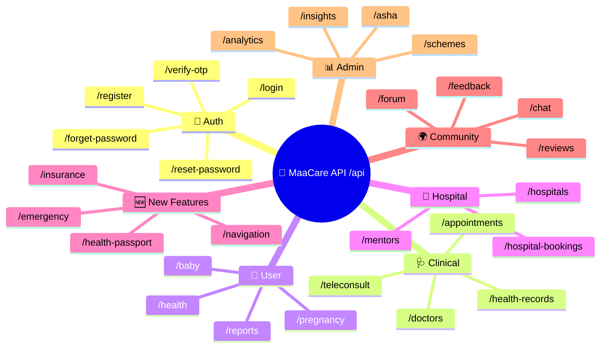
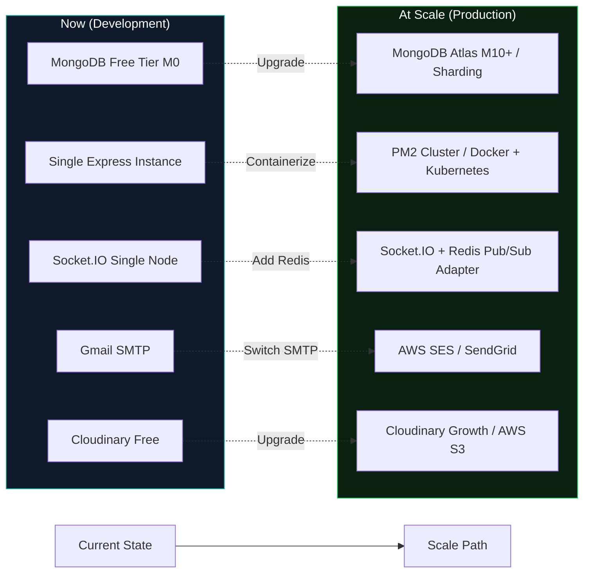

# 🏗️ MaaCare — System Architecture

> Technical architecture reference for the MaaCare maternal healthcare platform


*Three-layer architecture: Client (React/Vite) → Server (Node.js/Express) → Persistence (MongoDB/Cloudinary)*

---

## 📐 High-Level Architecture



---

## 🔒 Security Architecture Flow



---

## 🗂️ Complete Component Interaction Map

```mermaid
graph LR
    subgraph FE["Frontend Components"]
        NAV[Navbar]
        AUTH[AuthContext]
        APP[App.jsx Router]
        HOSP[HospitalDetails]
        BOOK[HospitalBookingForm]
        INS[InsuranceDashboard]
        PASS[HealthPassport]
        NAV2[HealthNavigation]
        SOS[EmergencySOSPanel]
        CHAT[Chat.jsx]
    end

    subgraph BE["Backend Services"]
        HB[/api/hospital-bookings]
        INSR[/api/insurance]
        HP[/api/health-passport]
        EM[/api/emergency]
        CH[/api/chat]
        NAV3[/api/navigation]
    end

    subgraph DB["MongoDB Collections"]
        HBDB[(HospitalBooking)]
        INSDB[(InsurancePolicy)]
        HPDB[(HealthPassport)]
        EMDB[(EmergencyEvent)]
        MSDB[(Message)]
    end

    BOOK -->|POST| HB --> HBDB
    INS -->|GET/POST/DELETE| INSR --> INSDB
    PASS -->|GET/POST| HP --> HPDB
    SOS -->|POST| EM --> EMDB
    CHAT -->|Socket.IO + POST| CH --> MSDB
    NAV2 -->|GET| NAV3

    style FE fill:#0f2027,stroke:#14b8a6,color:#fff
    style BE fill:#0a1628,stroke:#14b8a6,color:#fff
    style DB fill:#071224,stroke:#22d3ee,color:#fff
```

---

## 🗺️ Request Lifecycle



---

## 🔌 Real-Time Architecture (Socket.IO)



---

## 🏗️ Backend Route Structure



---

## 📦 Storage Architecture

| Data Type | Storage | Format | Size Limit |
|-----------|---------|--------|-----------|
| User profiles | MongoDB Atlas | BSON Documents | Unlimited |
| Health records (metadata) | MongoDB Atlas | BSON with ref | Unlimited |
| Profile images | Cloudinary | JPEG/PNG/WebP | 10 MB per file |
| Health documents | Cloudinary | PDF/Image | 10 MB per file |
| Insurance documents | Cloudinary | PDF/Image | 10 MB per file |
| Chat messages | MongoDB Atlas | BSON | Unlimited |
| Emergency events | MongoDB Atlas | BSON | Unlimited |
| JWT sessions | Client localStorage | String | N/A (stateless) |

---

## ⚖️ Scalability Considerations


