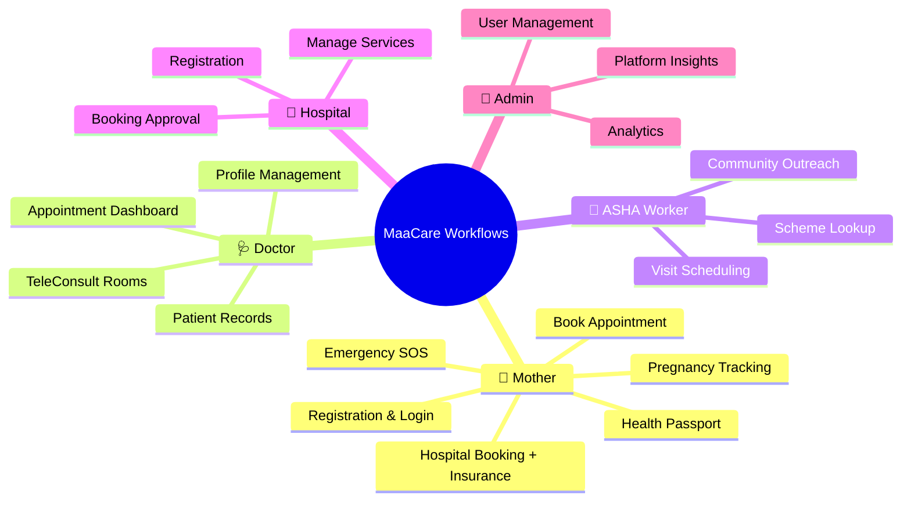
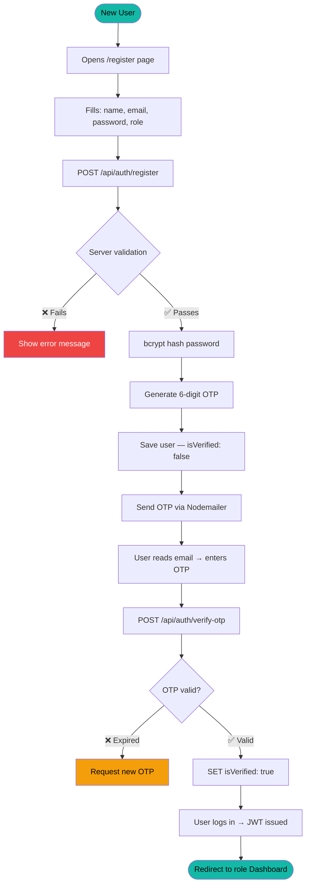
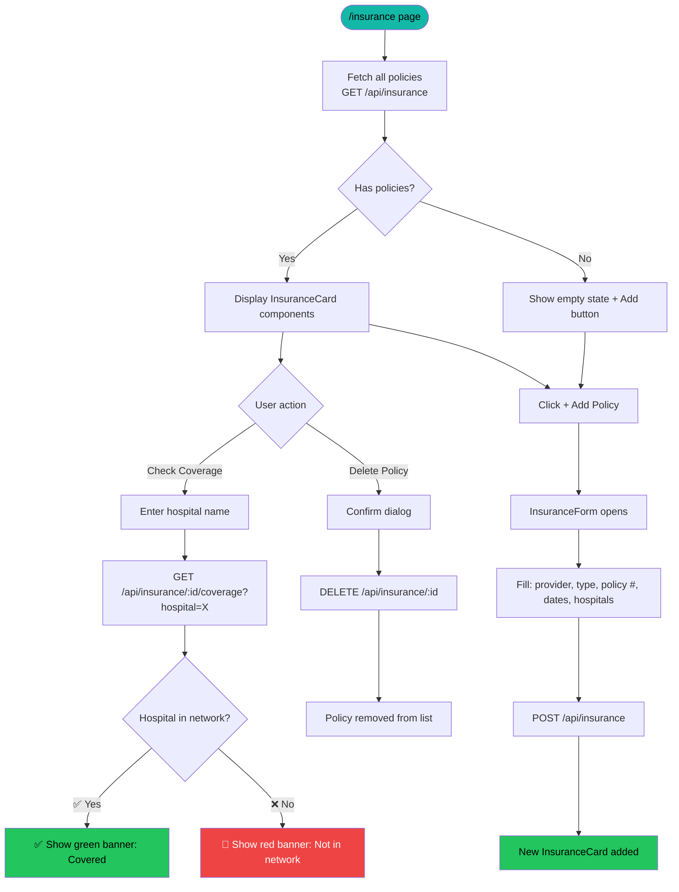
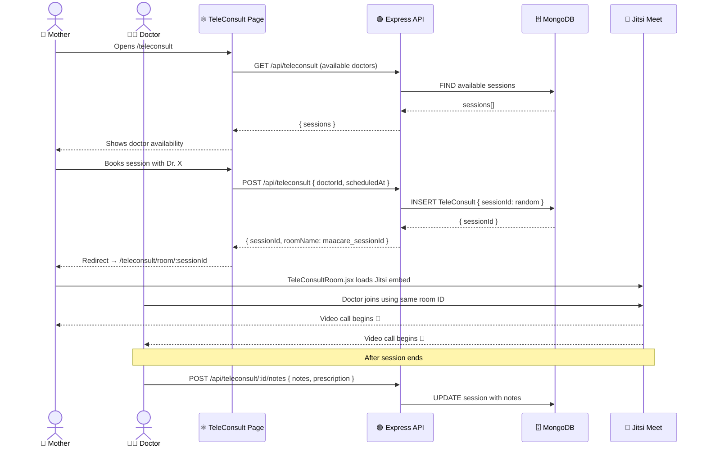
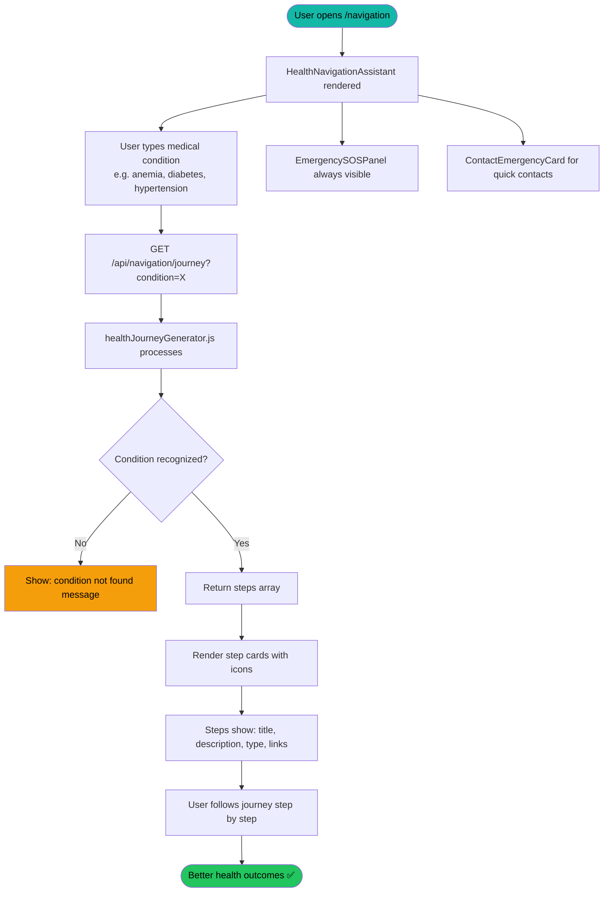

# ⚙️ MaaCare — User & System Workflow

> Complete end-to-end journey documentation for all platform user roles

---

## 🗂️ Module Overview



---

## 1. 🔐 User Registration & Login



---

## 2. 🏥 Hospital Booking + Insurance Workflow

```mermaid
flowchart LR
    A([Mother opens /hospitals]) --> B[Search & filter hospitals]
    B --> C[Click hospital → /hospitals/:id]
    C --> D[View services, beds, doctors]
    D --> E[Click 'Book This Service']
    E --> F[HospitalBookingForm opens]
    F --> G[Load insurance policies]
    G --> H{Has insurance?}
    H -->|No| I[Book without insurance]
    H -->|Yes| J[Select policy]
    J --> K[Estimated cost shown]
    K --> L[Fill: name, date, phone, notes]
    I --> L
    L --> M[Submit → POST /api/hospital-bookings]
    M --> N[Booking saved: status Pending]
    N --> O[📧 Confirmation email sent]
    O --> P([Hospital reviews booking])
    P --> Q{Hospital decision}
    Q -->|✅ Approve| R[Status → Approved + email]
    Q -->|❌ Reject| S[Status → Rejected + email]

    style A fill:#14b8a6,color:#000
    style K fill:#22c55e,color:#000
    style S fill:#ef4444,color:#fff
    style R fill:#22c55e,color:#000
```




---

## 3. 🛡️ Insurance Management Workflow



---

## 4. 🆔 Health Passport & QR Workflow

```mermaid
flowchart LR
    A([User opens /passport]) --> B[GET /api/health-passport]
    B --> C{Passport exists?}
    C -->|First time| D[Show empty form]
    C -->|Exists| E[Populate form with data]
    D --> F[User fills: blood type, allergies,\nconditions, vaccinations, doctor info]
    E --> F
    F --> G[Save → POST /api/health-passport]
    G --> H[Passport saved/updated in DB]
    H --> I[HealthPassportQR renders QR]
    I --> J[QR = JSON.stringify of passport data]
    J --> K([Mother shares/prints QR])
    K --> L[🏥 First Responder scans QR]
    L --> M[Instant medical context:\n🩸 Blood Group\n⚠️ Allergies\n💊 Conditions\n📞 Emergency Contact]

    style A fill:#14b8a6,color:#000
    style M fill:#22c55e,color:#000
```




---

## 5. 🚨 Emergency SOS Workflow


```mermaid
flowchart TD
    A([🔴 User clicks SOS button]) --> B[navigator.geolocation.getCurrentPosition]
    B --> C{Location granted?}
    C -->|❌ Denied| D[Alert: Please enable location]
    C -->|✅ Got location| E[Show: Locating you...]
    E --> F[POST /api/emergency/sos\n{lat, lng, riskLevel}]
    F --> G[Fetch EmergencyContact from DB]
    G --> H[INSERT EmergencyEvent record]
    H --> I[📧 Send SOS email:\n• Location map link\n• Timestamp\n• Contacts]
    I --> J[Backend response: success]
    J --> K[UI: ✅ Help is on the way!]
    K --> L[Show emergency contact numbers]
    L --> M([One-tap call: Doctor / Family / ASHA])

    style A fill:#ef4444,color:#fff
    style D fill:#f59e0b,color:#000
    style K fill:#22c55e,color:#000
    style M fill:#14b8a6,color:#000
```

---

## 6. 📹 Teleconsultation Workflow



---

## 7. 💬 Multilingual Chat Workflow

```mermaid
flowchart LR
    A([User opens /chat]) --> B[Load Contacts\nGET /api/chat/contacts]
    B --> C[Select conversation]
    C --> D[Load History\nGET /api/chat/:userId]
    D --> E[render message bubbles]
    E --> F[User types message]
    F --> G[POST /api/chat/send\n{to, text, language}]
    G --> H{Language different?}
    H -->|Yes| I[google-translate-api-x]
    I --> J[Save with translatedText]
    H -->|No| J
    J --> K[socket.io emit receive_message]
    K --> L([Recipient sees message instantly])

    style A fill:#14b8a6,color:#000
    style L fill:#14b8a6,color:#000
    style I fill:#f59e0b,color:#000
```

---

## 8. 🗺️ Health Navigation Workflow



---

## 9. 🎭 Role-Based Access Matrix


| Feature | 👩 Mother | 🩺 Doctor | 🌿 ASHA | 🏥 Hospital | 👑 Admin |
|---------|:---------:|:---------:|:-------:|:-----------:|:--------:|
| Health Dashboard | ✅ | ❌ | ❌ | ❌ | ❌ |
| Book Appointment | ✅ | ❌ | ❌ | ❌ | ❌ |
| Book Hospital Service | ✅ | ❌ | ❌ | ❌ | ❌ |
| Manage Insurance | ✅ | ✅ | ✅ | ✅ | ✅ |
| Health Passport | ✅ | ✅ | ✅ | ✅ | ✅ |
| Emergency SOS | ✅ | ✅ | ✅ | ✅ | ✅ |
| Doctor Panel | ❌ | ✅ | ❌ | ❌ | ❌ |
| ASHA Panel | ❌ | ❌ | ✅ | ❌ | ❌ |
| Hospital Panel | ❌ | ❌ | ❌ | ✅ | ❌ |
| Platform Analytics | ❌ | ❌ | ❌ | ❌ | ✅ |

> [!IMPORTANT]
> Role assignment is locked at registration. Admins can upgrade/downgrade user roles via the Admin Dashboard. JWT tokens carry the `role` field and all protected routes verify it via `authorize(...roles)` middleware.

---

## 10. ⏰ Background Job Scheduling

```mermaid
gantt
    title Daily Background Job Schedule
    dateFormat HH:mm
    section Notification Scheduler
    Query upcoming appointments    : 08:00, 1m
    Query due vaccinations          : 08:01, 1m
    Send reminder emails (batch)   : 08:02, 5m
    section Reminder Scheduler (Hourly)
    Query confirmed bookings       : 00:00, 1m
    Filter 24h-before bookings     : 00:01, 1m
    Send advance notice emails     : 00:02, 2m
```


