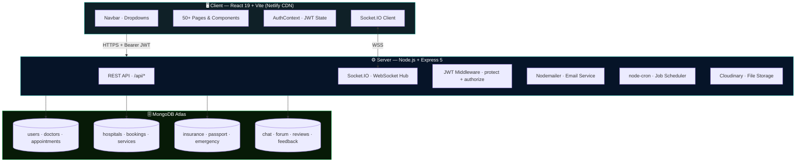
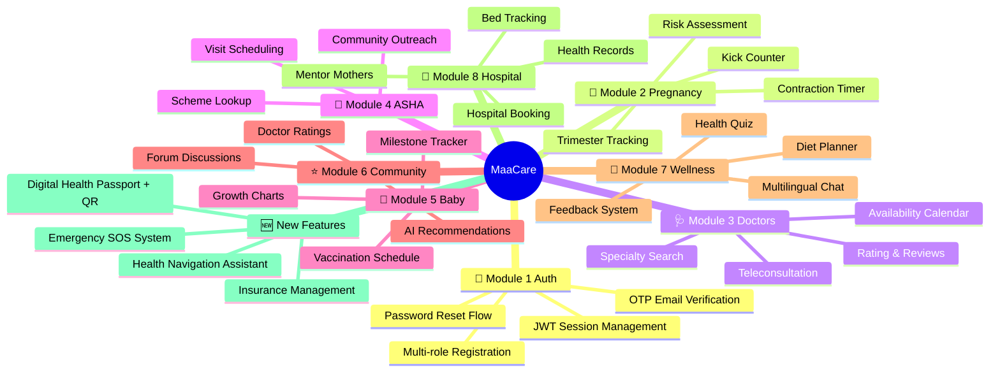
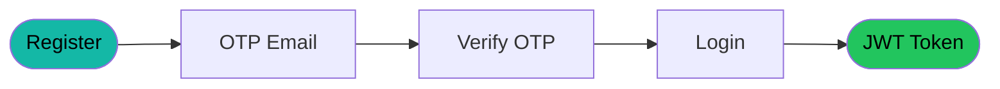
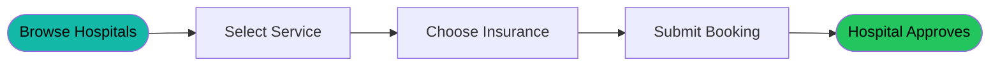

<h1 align="center">🤱 MaaCare</h1>
<h3 align="center">AI-Powered Maternal Healthcare Platform</h3>
<p align="center">
  <em>Connecting Mothers · Doctors · Hospitals · ASHA Workers — Across Every Corner of India</em>
</p>

<p align="center">
  
  
  
  
  
  
  
</p>

<p align="center">
  <a href="https://matrucare-ai.netlify.app/">🌐 Live Demo</a> &nbsp;|&nbsp;
  <a href="./BACKEND/README.md">📖 Backend Docs</a> &nbsp;|&nbsp;
  <a href="./FRONTEND/README.md">🖥️ Frontend Docs</a> &nbsp;|&nbsp;
  <a href="./System-Architecture.md">🏗️ Architecture</a> &nbsp;|&nbsp;
  <a href="./WorkFlow.md">⚙️ Workflows</a> &nbsp;|&nbsp;
  <a href="./DataFlow.md">🔄 Data Flow</a> &nbsp;|&nbsp;
  <a href="./ER-Diagram.md">🗃️ ER Diagram</a>
</p>

<hr>

## 📚 Table of Contents

- [About the Project](#-about-the-project)
- [Platform Architecture](#-platform-architecture)
- [Feature Modules](#-feature-modules)
- [Tech Stack](#-tech-stack)
- [Folder Structure](#️-folder-structure)
- [All Dependencies](#-all-dependencies)
- [Quick Start](#-quick-start)
- [Environment Variables](#-environment-variables)
- [Available Scripts](#-available-scripts)
- [Key Flows](#-key-flows)
- [Role Access Matrix](#-role-access-matrix)
- [Future Enhancements](#-future-enhancements)
- [Connect](#-connect)

<hr>

## 🌟 About the Project

MaaCare bridges the gap between India's expectant mothers and quality healthcare services. Built with a premium, dark glassmorphic UI and a robust Node.js backend, it enables:

- 🤰 **Mothers** — pregnancy tracking, doctor booking, diet plans, health passport, SOS
- 🩺 **Doctors** — appointment dashboards, patient records, teleconsultation rooms
- 🌿 **ASHA Workers** — community outreach, visit scheduling, scheme lookup
- 🏥 **Hospitals** — service listings, bed tracking, insurance-integrated bookings
- 👑 **Admins** — analytics, insights, platform management

> [!NOTE]
> MaaCare addresses critical gaps in India's maternal healthcare system: lack of teleconsult access in rural areas, fragmented insurance management, no portable medical identity, and absence of coordinated emergency communication.

<hr>

## 🏗️ Platform Architecture



<hr>

## ✨ Feature Modules



<hr>

## 🧰 Tech Stack

| Layer | Technology | Purpose |
|-------|-----------|---------|
| **Frontend** | React 19 + Vite 7 | UI framework + fast builds |
| **Styling** | Tailwind CSS 4 + Framer Motion | Responsive dark UI + animations |
| **Backend** | Node.js + Express 5 | REST API server |
| **Database** | MongoDB Atlas + Mongoose | NoSQL data persistence |
| **Authentication** | JWT + bcrypt | Stateless secure sessions |
| **Real-time** | Socket.IO | Live chat + SOS alerts |
| **Video** | Jitsi Meet SDK | In-browser teleconsultation |
| **Email** | Nodemailer (Gmail) | OTP, booking, SOS alerts |
| **File Storage** | Cloudinary + Multer | Profile images + health docs |
| **Scheduling** | node-cron | Daily reminders & notifications |
| **Translation** | google-translate-api-x | Multilingual chat messages |
| **QR Code** | react-qr-code | Health Passport QR generation |
| **Security** | Helmet.js | HTTP security headers |
| **Deployment** | Netlify (FE) | CDN + SPA redirect |

<hr>

## 🗂️ Folder Structure

```
MATRUCARE/
├── BACKEND/
│   ├── config/          db.js, nodemailer.js
│   ├── controllers/     28 controller files
│   ├── models/          25 Mongoose models
│   ├── routes/          28 route files
│   ├── utils/           roleMiddleware, schedulers, healthJourneyGenerator
│   ├── index.js         Express + Socket.IO entry point
│   └── package.json
│
├── FRONTEND/
│   ├── src/
│   │   ├── Components/  50+ reusable React components
│   │   ├── Pages/       30+ page components
│   │   ├── App.jsx      Router + Protected Routes
│   │   └── main.jsx     React entry point
│   ├── netlify.toml     SPA redirect config
│   └── package.json
│
├── README.md            ← This file
├── System-Architecture.md
├── WorkFlow.md
├── DataFlow.md
└── ER-Diagram.md
```

<hr>

## 📦 All Dependencies

<details>
<summary><strong>🔧 Backend packages (click to expand)</strong></summary>

| Package | Version | Purpose |
|---------|---------|---------|
| express | ^5.2.1 | HTTP server framework |
| mongoose | ^9.2.3 | MongoDB ODM |
| bcrypt | ^6.0.0 | Password hashing |
| jsonwebtoken | ^9.0.3 | JWT auth tokens |
| nodemailer | ^8.0.1 | Transactional emails |
| cloudinary | ^2.9.0 | Cloud file storage |
| multer | ^2.1.0 | File upload middleware |
| cors | ^2.8.6 | Cross-origin request handling |
| helmet | ^8.1.0 | HTTP security headers |
| socket.io | ^4.8.3 | WebSocket server |
| node-cron | ^4.2.1 | Job scheduler |
| google-translate-api-x | ^10.7.2 | Auto-translation |
| dotenv | ^17.3.1 | Environment variables |
| nodemon | ^3.1.14 | Dev auto-restart |

</details>

<details>
<summary><strong>🎨 Frontend packages (click to expand)</strong></summary>

| Package | Version | Purpose |
|---------|---------|---------|
| react | ^19.2.0 | UI framework |
| react-router-dom | ^7.13.1 | Client routing |
| axios | ^1.13.6 | HTTP API client |
| framer-motion | ^12.34.4 | Animations |
| lucide-react | ^0.576.0 | Icon components |
| tailwindcss | ^4.2.1 | Utility CSS |
| socket.io-client | ^4.8.3 | WebSocket client |
| react-qr-code | ^2.0.18 | QR code generator |
| @jitsi/react-sdk | ^1.4.4 | Video calls |
| i18next | ^25.8.13 | Internationalization |

</details>

<hr>

## ⚡ Quick Start

### Prerequisites
- Node.js ≥ 18.x
- MongoDB Atlas account
- Cloudinary account
- Gmail App Password

### 1. Clone & Install

```bash
git clone https://github.com/amangupta9454/maacare.git
cd MATRUCARE

# Install backend
cd BACKEND && npm install

# Install frontend
cd ../FRONTEND && npm install
```

### 2. Configure Environment

```bash
# BACKEND/.env
MONGODB_URI=mongodb+srv://<user>:<pass>@cluster.mongodb.net/maacare
PORT=5000
JWT_SECRET=your_secret_here
EMAIL_USER=youremail@gmail.com
EMAIL_PASS=your_gmail_app_password
CLOUDINARY_CLOUD_NAME=your_cloud
CLOUDINARY_API_KEY=your_key
CLOUDINARY_API_SECRET=your_secret
FRONTEND_URL=http://localhost:5173
```

```bash
# FRONTEND/.env
VITE_API_URL=http://localhost:5000/api
```

### 3. Run

```bash
# Terminal 1 — Backend
cd BACKEND && npm run dev

# Terminal 2 — Frontend
cd FRONTEND && npm run dev
```

```
Frontend: http://localhost:5173
Backend:  http://localhost:5000
```

<hr>

## 🔐 Environment Variables

### Backend
| Variable | Required | Description |
|----------|----------|-------------|
| `MONGODB_URI` | ✅ | MongoDB Atlas connection string |
| `PORT` | ✅ | Server port (default: 5000) |
| `JWT_SECRET` | ✅ | JWT signing key (32+ char random string) |
| `EMAIL_USER` | ✅ | Gmail sender address |
| `EMAIL_PASS` | ✅ | Gmail 16-char App Password |
| `CLOUDINARY_CLOUD_NAME` | ✅ | Cloudinary cloud name |
| `CLOUDINARY_API_KEY` | ✅ | Cloudinary API key |
| `CLOUDINARY_API_SECRET` | ✅ | Cloudinary API secret |
| `FRONTEND_URL` | ✅ | Frontend URL for CORS whitelist |

### Frontend
| Variable | Required | Description |
|----------|----------|-------------|
| `VITE_API_URL` | ✅ | Backend URL **including /api** (e.g. `http://localhost:5000/api`) |

<hr>

## 🖥️ Available Scripts

| Directory | Command | Description |
|-----------|---------|-------------|
| Backend | `npm run dev` | nodemon auto-restart dev server |
| Backend | `npm start` | Production server |
| Frontend | `npm run dev` | Vite dev server (port 5173) |
| Frontend | `npm run build` | Production build → `dist/` |
| Frontend | `npm run preview` | Preview production build |

<hr>

## 🔄 Key Flows

### Authentication Flow



### Emergency SOS Flow


### Hospital Booking Flow



<hr>

## 👥 Role Access Matrix

| Feature | 👩 Mother | 🩺 Doctor | 🌿 ASHA | 🏥 Hospital | 👑 Admin |
|---------|:---------:|:---------:|:-------:|:-----------:|:--------:|
| Health Dashboard | ✅ | ❌ | ❌ | ❌ | ❌ |
| Book Appointment | ✅ | ❌ | ❌ | ❌ | ❌ |
| Hospital Booking | ✅ | ❌ | ❌ | ❌ | ❌ |
| Insurance Manage | ✅ | ✅ | ✅ | ✅ | ✅ |
| Health Passport | ✅ | ✅ | ✅ | ✅ | ✅ |
| Emergency SOS | ✅ | ✅ | ✅ | ✅ | ✅ |
| Doctor Panel | ❌ | ✅ | ❌ | ❌ | ❌ |
| ASHA Panel | ❌ | ❌ | ✅ | ❌ | ❌ |
| Hospital Panel | ❌ | ❌ | ❌ | ✅ | ❌ |
| Analytics | ❌ | ❌ | ❌ | ❌ | ✅ |

<hr>

## 🚀 Future Enhancements

- 📱 **Native App** — React Native Android/iOS version
- 🤖 **Gemini AI** — Symptom checker + risk prediction with Google AI
- 🗣️ **Voice-First UI** — For low-literacy rural users
- 💊 **Pharmacy Integration** — Medicine ordering + reminders
- 🌍 **Full Multilingual UI** — Hindi, Marathi, Bengali, Tamil
- 🔗 **ABDM Integration** — Ayushman Bharat Digital Mission health ID
- 📊 **ML Risk Scoring** — Predictive maternal risk assessment model

<hr>

## 📬 Connect

> Open to collaborations in HealthTech, social impact platforms, and full-stack development.

<p align="center">
  <strong>Aman Gupta</strong> — Full-Stack Developer & HealthTech Builder
</p>

| | |
|--|--|
| 📧 Email | [ag0567688@gmail.com](mailto:ag0567688@gmail.com) |
| 💼 LinkedIn | [linkedin.com/in/amangupta9454](https://linkedin.com/in/amangupta9454) |
| 💻 GitHub | [github.com/amangupta9454](https://github.com/amangupta9454) |
| 🌐 Portfolio | [gupta-aman-portfolio.netlify.app](http://gupta-aman-portfolio.netlify.app/) |

<p align="center">
  
  
  
</p>

<p align="center">
  ⭐ If MaaCare inspired you, give it a star on GitHub — it means the world!
</p>
